# SkillSync

### Peer-to-Peer Skill Swapping Platform

> **Learn a skill. Teach a skill. Swap knowledge.**

SkillSync is a full-stack MERN application that enables users to exchange knowledge through peer-to-peer skill learning.

Users can:

- Create profiles and manage their skills
- List skills they can teach and skills they want to learn
- Discover compatible learning partners
- Send and manage learning requests
- Chat with matched users
- Share learning resources
- Schedule one-to-one learning sessions
- Track session progress, notes and milestones
- Receive session reminders and notifications
- Review completed sessions
- Report inappropriate behaviour

The platform is based on a simple idea:

> **Everyone can be both a learner and a teacher.**

Instead of paying for a traditional course, users can exchange their existing knowledge with other learners and build mutually beneficial learning relationships.

---

# Why SkillSync?

Traditional learning platforms generally follow a teacher-to-student model. SkillSync takes a peer-to-peer approach.

A user may have a skill they can teach while simultaneously wanting to learn something else.

For example:

```text
        User A                         User B

    Can teach: React              Can teach: Guitar
    Wants to learn: Guitar        Wants to learn: React

             └────────── Match ──────────┘
                          ↓
                    Skill Exchange
                          ↓
                  Chat + Sessions
                          ↓
                  Learn & Teach
```

This creates a collaborative learning environment where users exchange knowledge rather than simply consuming courses.

---

# Problem Statement

Many students and professionals want to learn practical skills but may not have access to affordable courses, instructors or personalized guidance.

At the same time, many people already possess valuable knowledge that they are willing to share.

The problem is connecting these two groups:

- **People who want to learn a skill**
- **People who can teach that skill**

SkillSync addresses this gap by matching users based on their teaching and learning requirements and providing the tools required to take the interaction from discovery to an actual learning session.

---

# Solution

SkillSync provides an end-to-end peer learning workflow:

```text
Register / Login
       ↓
Create Profile
       ↓
Add Skills to Teach & Learn
       ↓
Discover Compatible Matches
       ↓
Send Learning Request
       ↓
Request Accepted
       ↓
Active Match
       ↓
Chat
       ↓
Schedule Learning Session
       ↓
Session Reminder
       ↓
Conduct Session
       ↓
Track Progress
       ↓
Complete Session
       ↓
Leave Review
```

The platform also includes an administrative layer for user moderation, reports and platform management.

---

# Key Features

## User Journey

SkillSync follows a complete peer-to-peer learning workflow from profile creation to session completion.

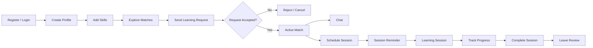

### User Flow

1. **Register / Login**  
   Create an account and securely access the platform.

2. **Create Profile**  
   Add profile information, availability, city and timezone.

3. **Add Skills**  
   Specify skills that can be taught and skills that the user wants to learn.

4. **Explore Matches**  
   Discover users whose teaching and learning requirements are compatible.

5. **Send Learning Request**  
   Initiate a learning exchange with a potential match.

6. **Accept Request**  
   Once accepted, the users become an active match.

7. **Chat**  
   Communicate and exchange learning resources.

8. **Schedule Session**  
   Select the relevant skill, date, duration and meeting link.

9. **Session Reminder**  
   Participants receive an in-app reminder before the scheduled session.

10. **Conduct Session**  
    Meet using the provided meeting link and work through the learning objective.

11. **Track Progress**  
    Add notes, resources and milestones.

12. **Complete & Review**  
    Complete the session and leave a rating and review.

---

# Admin Journey

Administrators have a separate management workflow for maintaining platform safety and monitoring activity.

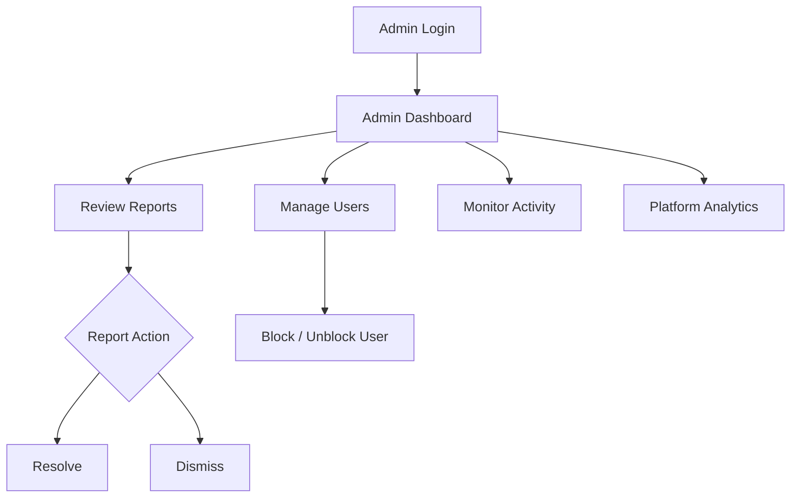

---

# Technology Stack

SkillSync is built using the **MERN Stack**, with additional libraries and tools for authentication, file uploads, UI development and API communication.

| Layer | Technology | Purpose |
|---|---|---|
| Frontend | React.js | Building the user interface |
| Build Tool | Vite | Frontend development and production builds |
| Styling | Tailwind CSS | Responsive and consistent UI |
| Routing | React Router | Client-side page navigation |
| API Communication | Axios | Communication between frontend and backend |
| Backend | Node.js | Server-side JavaScript runtime |
| API Framework | Express.js | REST API and backend routing |
| Database | MongoDB | Persistent application data |
| ODM | Mongoose | MongoDB schema and database operations |
| Authentication | JWT | Secure user authentication |
| Password Security | bcryptjs | Password hashing |
| File Uploads | Multer | Chat attachment handling |
| Environment Configuration | dotenv | Environment variable management |
| Cross-Origin Requests | CORS | Frontend-backend communication |

> **Note:** Vite is used as the React build and development tool. The application itself follows the MERN architecture: MongoDB, Express.js, React.js and Node.js.

---

# MERN Architecture

```text
┌─────────────────────────────────────────────┐
│                 React.js                    │
│              Frontend / UI                  │
│              + Vite Build Tool              │
└──────────────────────┬──────────────────────┘
                       │
                       │ Axios / REST API
                       ▼
┌─────────────────────────────────────────────┐
│              Node.js + Express              │
│                  Backend                    │
│                                             │
│ Authentication │ Matching │ Sessions        │
│ Chat           │ Reviews  │ Notifications   │
│ Reports        │ Admin    │ File Uploads    │
└──────────────────────┬──────────────────────┘
                       │
                       │ Mongoose
                       ▼
┌─────────────────────────────────────────────┐
│                   MongoDB                   │
│                                             │
│ Users │ Skills │ Matches │ Sessions         │
│ Chat  │ Reviews │ Reports │ Notifications   │
└─────────────────────────────────────────────┘
```

---

# System Architecture

SkillSync follows a layered client-server architecture.

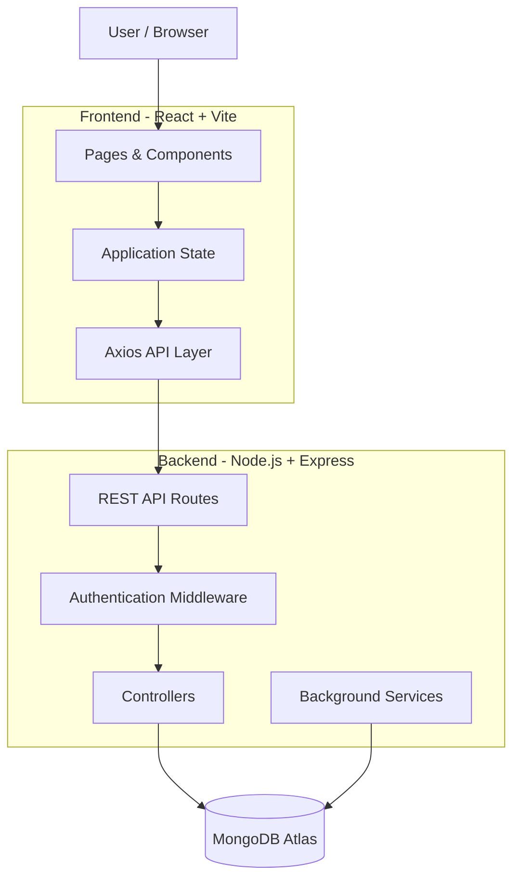

## Architecture Layers

### 1. Presentation Layer

The React frontend provides the interface through which users interact with SkillSync.

It contains:

- Authentication pages
- Profile pages
- Skill management
- Match exploration
- Learning requests
- Sessions
- Chat
- Notifications
- Reviews
- Admin dashboard

### 2. API Layer

The frontend communicates with the backend through REST APIs using Axios.

The API layer separates frontend presentation from backend business logic and database operations.

### 3. Backend Layer

The Express.js backend handles:

- Authentication
- Authorization
- User management
- Skill management
- Matching
- Learning requests
- Session scheduling
- Chat
- Notifications
- Reviews
- Reports
- Administration

The backend is organized into routes, controllers, middleware, models and services.

### 4. Data Layer

MongoDB stores the application's persistent data.

Mongoose is used to define schemas, relationships and database operations.

Major collections include:

```text
Users
Skills
Matches
LearningRequests
Sessions
Conversations
Messages
Notifications
Reviews
Reports
```

---

# Backend Request Flow

A typical API request follows this structure:

```text
React Frontend
      │
      ▼
Axios Request
      │
      ▼
Express Route
      │
      ▼
Authentication Middleware
      │
      ▼
Controller
      │
      ▼
Mongoose Model
      │
      ▼
MongoDB
      │
      ▼
Controller Response
      │
      ▼
React UI
```

This separation makes the application easier to maintain, test and extend.

---

# Database Design

SkillSync uses **MongoDB with Mongoose** for persistent data storage.

The application is organized around separate collections for users, skills, matches, requests, sessions, conversations, messages, notifications, reviews and reports.

## Main Data Models

| Model | Purpose |
|---|---|
| `User` | Stores account, profile, availability and role information |
| `Skill` | Stores skills users can teach or want to learn |
| `Match` | Represents compatible users and their matched skills |
| `LearningRequest` | Manages the request and acceptance lifecycle |
| `Session` | Stores scheduled peer-learning sessions |
| `Conversation` | Represents chat conversations between matched users |
| `Message` | Stores messages and chat attachments |
| `Notification` | Stores in-app notifications and reminders |
| `Review` | Stores ratings and feedback for completed sessions |
| `Report` | Stores user-submitted complaints and moderation information |

## Entity Relationship Overview

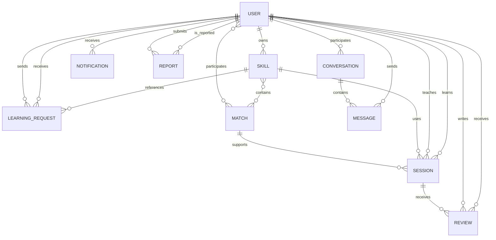

---

# Core Modules

## 1. Authentication & Authorization

SkillSync uses JWT-based authentication.

### Registration

```text
User Registration
      ↓
Validate Input
      ↓
Hash Password
      ↓
Create User
```

### Login

```text
Login Credentials
      ↓
Find User
      ↓
Verify Password
      ↓
Generate JWT
      ↓
Authenticated Session
```

Protected backend routes use authentication middleware to identify the currently logged-in user.

Administrative routes additionally enforce administrator-level access.

---

## 2. User Profiles

Users can maintain their learning profile with information such as:

- Name
- Email
- Bio
- City
- Timezone
- Availability
- Profile information
- Skills

Profiles allow other users to understand a potential learning partner before sending a request.

---

## 3. Skill Management

Users can maintain two types of skills:

```text
Skills I Can Teach
        +
Skills I Want to Learn
```

Each skill can contain information such as:

- Skill name
- Type
- Level
- Category
- Optional proof

This information forms the basis of SkillSync's matching system.

---

## 4. Skill Matching

SkillSync uses a **rule-based matching algorithm** rather than an AI or machine-learning model.

The system compares the current user's skills with the skills of other users.

For example:

```text
User A

Can Teach:
React

Wants to Learn:
Python
```

and:

```text
User B

Can Teach:
Python

Wants to Learn:
React
```

The system identifies the complementary relationship:

```text
User A teaches React → User B wants React
User B teaches Python → User A wants Python
```

This creates a mutual learning opportunity.

The matching process is deterministic and based on skill alignment.

---

## 5. Learning Requests

After discovering a suitable user, a learning request can be sent.

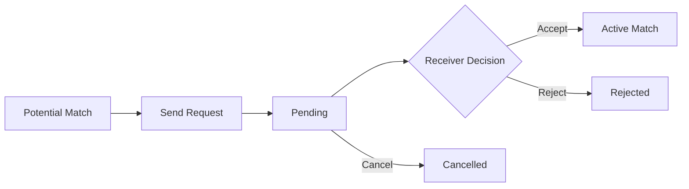

The request system manages the request lifecycle and prevents invalid interactions such as sending requests to oneself.

---

## 6. Active Matches

An accepted learning request creates an active relationship between the users.

Active matches provide the foundation for:

- Chat
- Session scheduling
- Skill exchange
- Progress tracking
- Reviews

---

## 7. Session Management

Sessions represent scheduled peer-learning activities.

A session contains information such as:

- Teacher
- Learner
- Match
- Skill
- Scheduled time
- Duration
- Meeting link
- Status
- Notes
- Progress
- Milestones

### Session Lifecycle

```text
Scheduled
    │
    ├── Completed
    │
    └── Cancelled
```

When scheduling a session, the application validates the selected skill, date/time and required session information before creating the session.

---

## 8. Session Reminders

SkillSync includes a background reminder service.

The service periodically checks scheduled sessions and identifies sessions approaching their scheduled time.

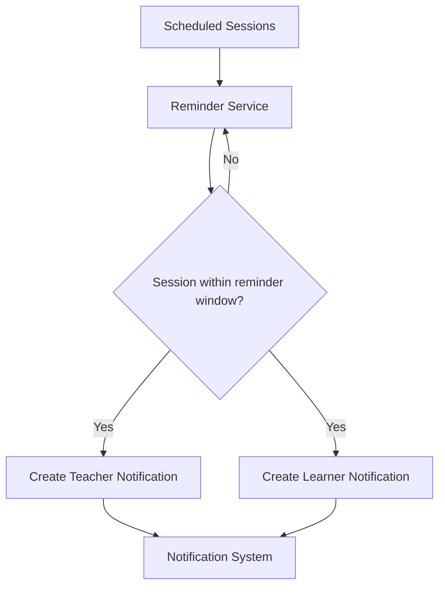

Both participants receive an in-app reminder before the scheduled session.

---

## 9. In-App Chat

Chat allows matched users to communicate before and during their learning relationship.

The chat system supports:

- Conversations
- Messages
- Message history
- File attachments

Supported attachment formats include:

```text
PDF
DOC
DOCX
PNG
JPG
JPEG
```

Multer is used for processing uploaded files.

---

## 10. Notifications

The notification system provides a centralized way of informing users about important platform events.

Supported notification types include:

- Learning requests
- Request acceptance
- Request rejection
- Session scheduling
- Session reminders
- Session completion
- Session cancellation
- Reviews
- Messages

Users can:

- View notifications
- See the unread count
- Mark an individual notification as read
- Mark all notifications as read

---

## 11. Session Progress

Each learning session can be used to track the learner's progress.

Users can maintain:

- Session notes
- Resources
- Progress percentage
- Milestones

This transforms the platform from a simple matching system into a basic learning-tracking platform.

---

## 12. Reviews & Ratings

After completing a session, users can provide feedback.

Reviews include:

- Rating
- Written comment
- Session association
- Reviewer
- Reviewed user

The review system provides a mechanism for building trust between peers.

---

## 13. Reports & Moderation

Users can report another user when they encounter inappropriate behaviour.

A report contains:

- Reporter
- Reported user
- Reason
- Description
- Status

The system prevents duplicate pending reports from the same reporter against the same user.

Administrators can review and manage submitted reports.

---

## 14. Admin Panel

SkillSync includes a dedicated administrative interface.

The admin module provides functionality for:

- User management
- Report management
- User blocking/unblocking
- Flagged-user monitoring
- Platform analytics
- Administrative data management

Administrative operations are protected through role-based authorization.

---

# Project Structure

SkillSync follows a modular frontend-backend structure.

```text
SkillSync/
│
├── client/
│   ├── src/
│   │   ├── api/
│   │   ├── components/
│   │   │   ├── common/
│   │   │   ├── layout/
│   │   │   └── UI/
│   │   ├── layouts/
│   │   ├── pages/
│   │   │   ├── Admin/
│   │   │   ├── Chat/
│   │   │   ├── Login/
│   │   │   ├── Matches/
│   │   │   ├── Profile/
│   │   │   ├── Register/
│   │   │   ├── Requests/
│   │   │   ├── Sessions/
│   │   │   └── Skills/
│   │   ├── styles/
│   │   ├── App.jsx
│   │   └── main.jsx
│   │
│   └── package.json
│
├── server/
│   ├── config/
│   ├── controllers/
│   ├── middleware/
│   ├── models/
│   ├── routes/
│   ├── services/
│   ├── utils/
│   ├── uploads/
│   ├── app.js
│   └── server.js
│
├── .gitignore
└── README.md
```

## Backend Organization

```text
Routes
  ↓
Middleware
  ↓
Controllers
  ↓
Models
  ↓
MongoDB
```

### Routes

Routes define the API endpoints exposed by the backend.

### Middleware

Middleware handles cross-cutting functionality such as authentication and authorization.

### Controllers

Controllers contain request handling and application logic.

### Models

Mongoose models define the structure of MongoDB documents and database operations.

### Services

Background and reusable application services are kept separately from HTTP request controllers.

For example, the session reminder service periodically checks upcoming sessions and creates reminder notifications.

---

# API Overview

SkillSync exposes REST APIs through the Express.js backend.

All application APIs are prefixed with:

```text
/api
```

| Module | Base Endpoint | Purpose |
|---|---|---|
| Authentication | `/api/auth` | Registration and login |
| Users | `/api/users` | User profiles and availability |
| Skills | `/api/skills` | Skill management |
| Matches | `/api/matches` | Match discovery and management |
| Learning Requests | `/api/learning-requests` | Request lifecycle |
| Sessions | `/api/sessions` | Session scheduling and management |
| Reviews | `/api/reviews` | Ratings and reviews |
| Chat | `/api/chat` | Conversations and messages |
| Notifications | `/api/notifications` | In-app notifications |
| Reports | `/api/reports` | User reporting |
| Admin | `/api/admin` | Administrative operations |

---

# Getting Started

## Prerequisites

- Node.js v18+ recommended
- npm
- MongoDB or MongoDB Atlas
- Git

## 1. Clone the Repository

```bash
git clone https://github.com/RigSri/SkillSync.git
cd SkillSync
```

## 2. Install Backend Dependencies

```bash
cd server
npm install
```

## 3. Configure Backend Environment

Create:

```text
server/.env
```

Example:

```env
PORT=5000
MONGO_URI=your_mongodb_connection_string
JWT_SECRET=your_jwt_secret
```

> Never commit the real `.env` file to GitHub.

## 4. Start the Backend

```bash
npm run dev
```

Or:

```bash
node server.js
```

## 5. Install Frontend Dependencies

Open a second terminal:

```bash
cd client
npm install
```

## 6. Configure Frontend API

For local development, configure the frontend API endpoint as:

```text
http://localhost:5000/api
```

For production, the deployed Render backend URL is used.

## 7. Start the Frontend

```bash
npm run dev
```

Vite will display the local development URL in the terminal.

---

# Environment Variables

## Backend

```env
PORT=5000
MONGO_URI=mongodb+srv://<username>:<password>@<cluster>/<database>
JWT_SECRET=your_secure_secret
```

| Variable | Description |
|---|---|
| `PORT` | Port used by the Express server |
| `MONGO_URI` | MongoDB / MongoDB Atlas connection string |
| `JWT_SECRET` | Secret used to sign authentication tokens |

Production secrets are stored through deployment-platform environment variables and are not committed to GitHub.

---

# Application Screenshots

The following screenshots showcase the major workflows and interfaces of SkillSync.

## Authentication

### Login

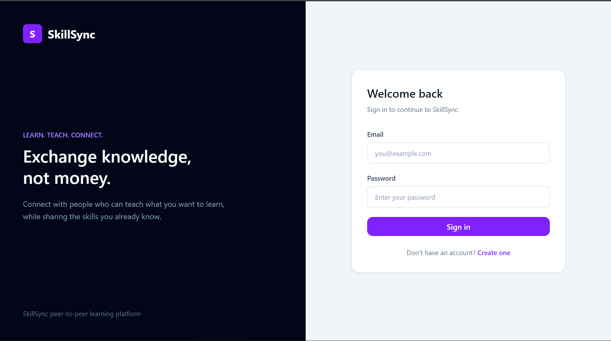

### Registration

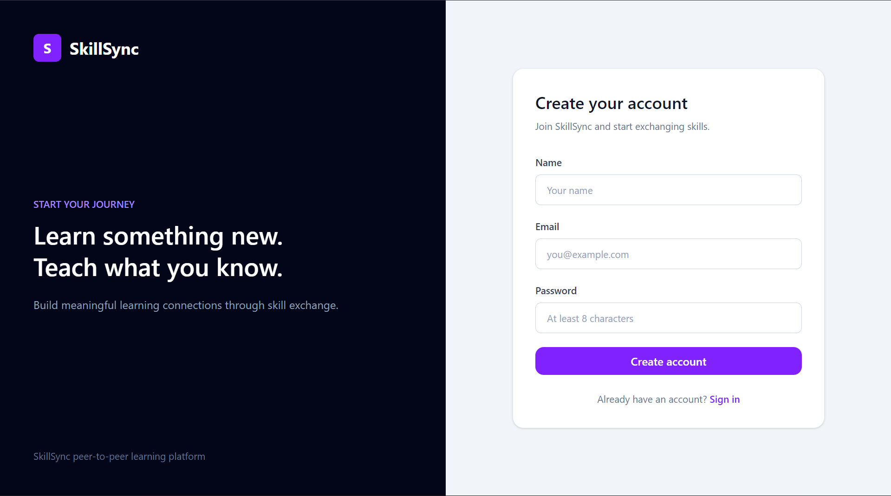

---

## Profile & Skills

### User Profile

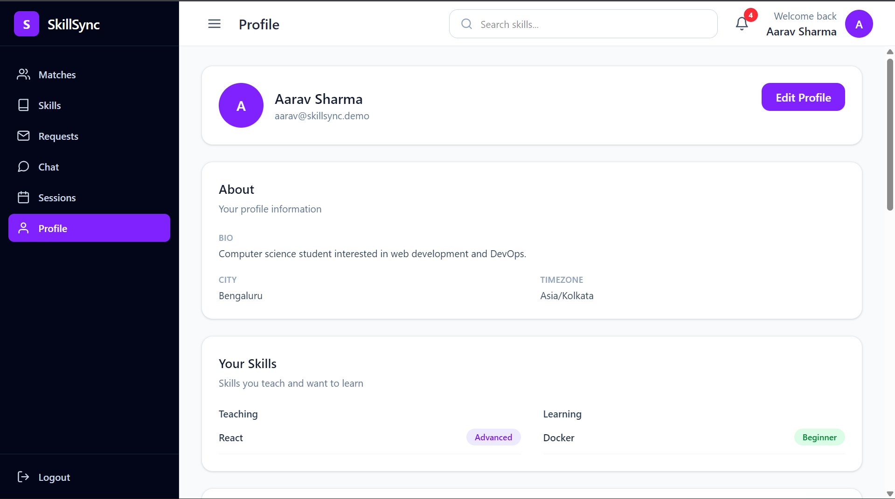

### Skills Management

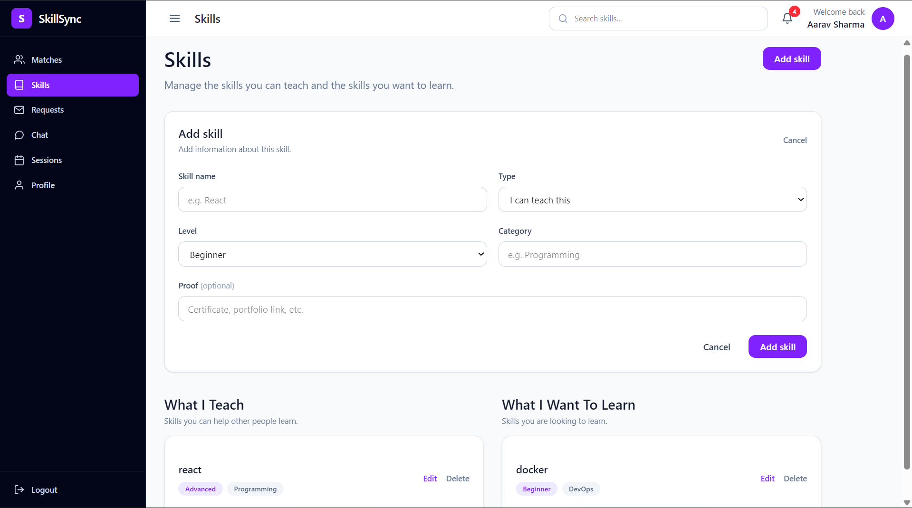

---

## Matching

### Match Explorer

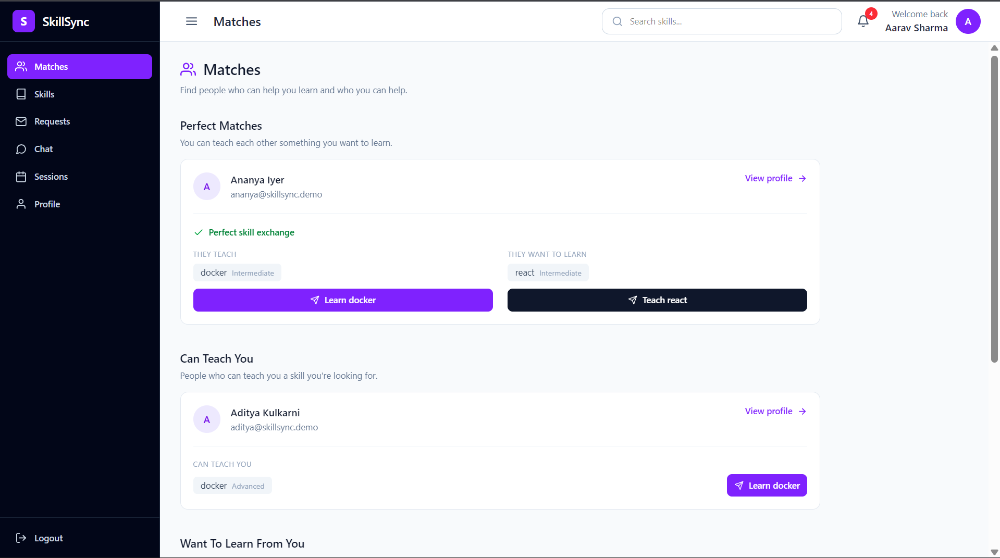

---

## Learning Requests

### Requests

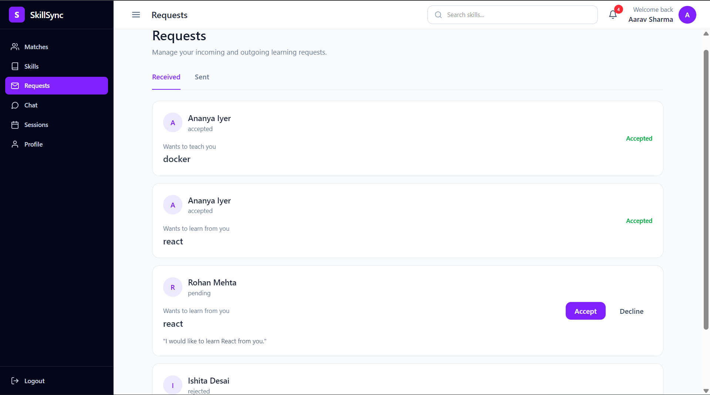

---

## Sessions

### Upcoming Sessions

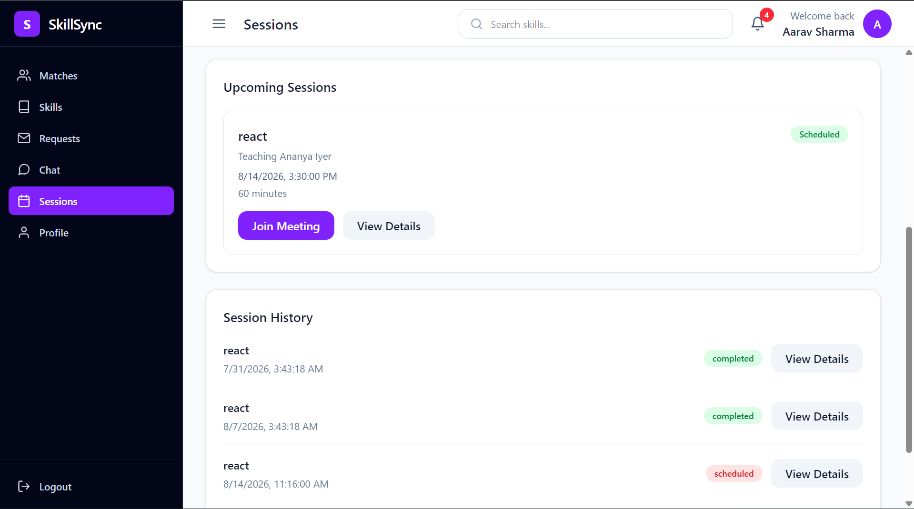

### Schedule a Session

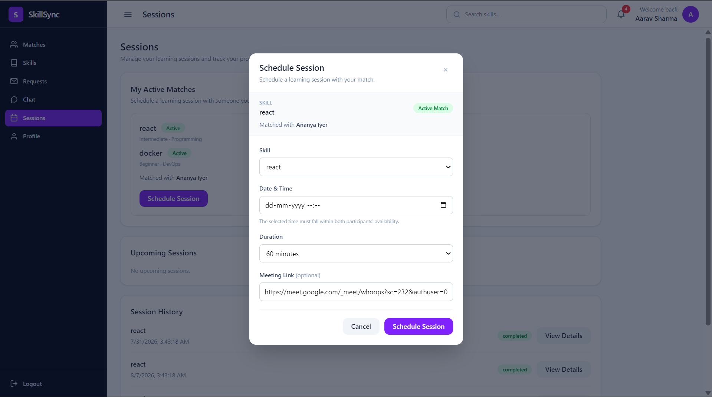

---

## Chat

### In-App Chat

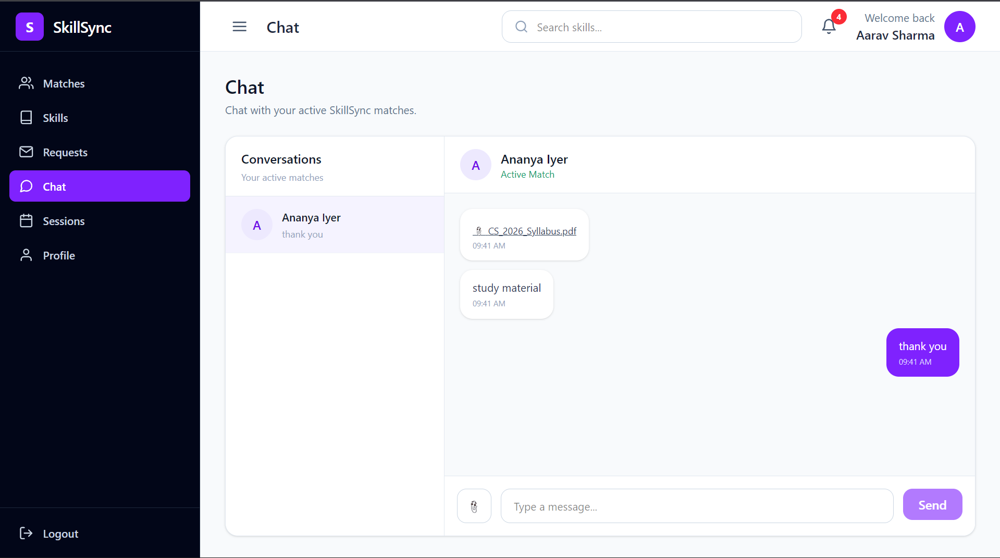

---

## Notifications

### Notification Center

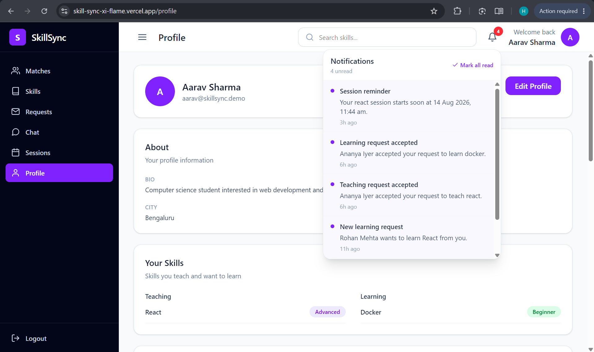

---

## Progress & Reviews

### Session Progress

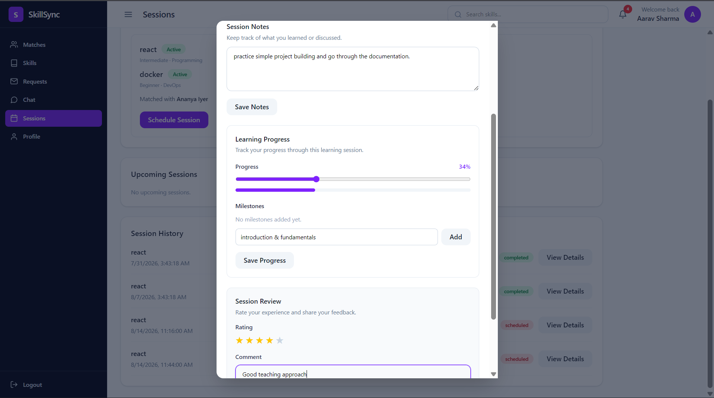

### Reviews

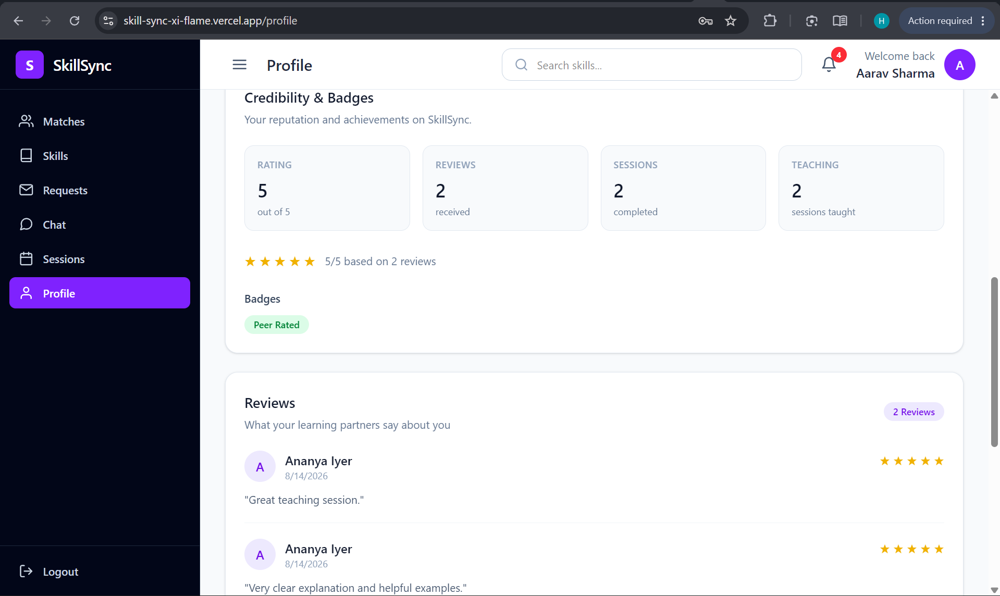

---

## Administration

### Admin Dashboard

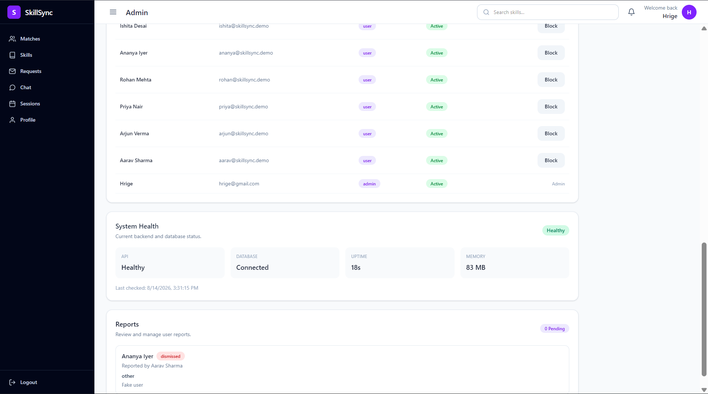

---

# Deployment

SkillSync is deployed using separate frontend and backend services, with MongoDB Atlas as the cloud database.

## Deployment Architecture

```text
                    User Browser
                         │
                         ▼
              ┌─────────────────────┐
              │   Vercel Frontend   │
              │   React + Vite      │
              └──────────┬──────────┘
                         │
                         │ HTTPS REST API
                         ▼
              ┌─────────────────────┐
              │   Render Backend    │
              │ Node.js + Express   │
              └──────────┬──────────┘
                         │
                         │ Mongoose
                         ▼
              ┌─────────────────────┐
              │    MongoDB Atlas    │
              │      Database       │
              └─────────────────────┘
```

### Deployment Components

| Component | Platform | Purpose |
|---|---|---|
| Frontend | Vercel | React + Vite frontend |
| Backend | Render | Node.js + Express REST API |
| Database | MongoDB Atlas | Persistent application data |
| Source Code | GitHub | Version control |

### Production URLs

**Live Application:**  
https://skill-sync-xi-flame.vercel.app

**Backend API:**  
https://skillsync-backend-09u0.onrender.com

**GitHub Repository:**  
https://github.com/RigSri/SkillSync

### Production Request Flow

```text
User
  ↓
Vercel
React + Vite
  ↓
HTTPS REST API
  ↓
Render
Node.js + Express
  ↓
MongoDB Atlas
  ↓
API Response
  ↓
React UI
```

## Production Validation

The deployed frontend was tested using browser Developer Tools.

Production API requests were verified to use the deployed backend rather than the local development server.

Example:

```text
GET https://skillsync-backend-09u0.onrender.com/api/matches
```

The deployed backend health endpoint was also verified successfully.

---

# Testing & Validation

The application was tested locally and on the deployed production environment.

## Functional Testing

The following workflows were tested:

- User registration and login
- Profile management
- Skill creation and editing
- Match discovery
- Learning requests
- Request acceptance and rejection
- Active matches
- In-app chat
- Chat file uploads
- Session scheduling
- Upcoming sessions
- Session progress tracking
- Session reminders
- Notifications
- Marking notifications as read
- Session completion
- Reviews and ratings
- User reporting
- Admin dashboard
- User blocking and unblocking

## Production Testing

The deployed application was tested through the Vercel frontend.

```text
Frontend
    ↓
Vercel
    ↓ HTTPS
Render Backend
    ↓
MongoDB Atlas
```

The production Network requests confirmed that API calls were being sent to the Render backend.

### Deployment Status

| Component | Status |
|---|---|
| React Frontend | Deployed |
| Node.js Backend | Deployed |
| MongoDB Atlas | Connected |
| Production API | Working |
| Authentication | Tested |
| Matching | Tested |
| Chat | Tested |
| Sessions | Tested |
| Session Reminders | Tested |
| Notifications | Tested |
| Reviews | Tested |
| Reports | Tested |
| Admin Panel | Tested |

---

# Problems Faced & Solutions

During development, several issues were encountered while integrating the different modules of the application.

## 1. Match Ownership & User Identification

**Problem:**  
When displaying matches, the application needed to correctly identify the logged-in user and display the other participant as the matched user.

**Solution:**  
The logged-in user's ID is obtained from the authenticated client session and compared against the users associated with each match.

---

## 2. Session Scheduling

**Problem:**  
Scheduling a session required coordinating the selected match, skill, date/time, duration and meeting link.

**Solution:**  
Validation was implemented to ensure that:

- A valid match is selected
- A valid skill is selected
- The scheduled time is valid
- Required session information is provided
- The session is associated with the correct participants

---

## 3. Session Reminder Service

**Problem:**  
The application needed to notify both participants before an upcoming session.

**Solution:**  
A dedicated background service was implemented to periodically check scheduled sessions. When a session enters the configured reminder window, notifications are created for both the teacher and learner.

Duplicate reminders are prevented by checking whether a reminder already exists for the session.

---

## 4. Chat & Conversation Handling

**Problem:**  
Chat functionality depends on correctly identifying conversations between matched users.

**Solution:**  
Conversation creation and retrieval were separated from the learning-request flow, allowing the chat system to work independently while remaining connected to active matches.

---

## 5. Chat File Uploads

**Problem:**  
The chat system needed to support learning resources while preventing unsupported files from being uploaded.

**Solution:**  
Multer was used for handling uploads with file-type and file-size validation.

Supported formats include:

```text
PDF
DOC
DOCX
PNG
JPG
JPEG
```

---

## 6. Reports

**Problem:**  
The reporting system needed to prevent users from repeatedly submitting identical unresolved reports.

**Solution:**  
The backend checks for an existing pending report from the same reporter against the same user before creating a new report.

---

## 7. Notifications

**Problem:**  
Multiple features generate notifications, including requests, sessions, reviews and reminders.

**Solution:**  
A centralized notification model was implemented with notification types, recipients, related entities and read status.

Users can:

- View notifications
- View unread count
- Mark individual notifications as read
- Mark all notifications as read

---

## 8. Authentication & Protected Routes

**Problem:**  
Sensitive operations such as sessions, chat, reports and administration should not be accessible to unauthenticated users.

**Solution:**  
JWT authentication middleware was implemented on protected API routes. Administrative operations additionally use role-based authorization.

---

## 9. Integrating Multiple MERN Modules

**Problem:**  
Features such as matching, requests, chat, sessions, notifications and reviews are interconnected.

For example:

```text
Match
  ↓
Learning Request
  ↓
Accepted Match
  ↓
Chat
  ↓
Session
  ↓
Reminder
  ↓
Completion
  ↓
Review
```

**Solution:**  
The application was divided into separate frontend API modules, backend routes, controllers, models and services. This modular structure made it easier to isolate problems and test individual features.

---

# Key Learnings

Developing SkillSync provided practical experience across the complete MERN development lifecycle.

### Frontend Development

- Building reusable React components
- Managing application state
- Creating responsive interfaces
- Implementing protected routes
- Connecting React applications to REST APIs
- Handling asynchronous API operations

### Backend Development

- Designing REST APIs with Express.js
- Structuring routes and controllers
- Implementing middleware
- Implementing authentication and authorization
- Validating requests
- Handling backend errors

### Database Development

- Designing MongoDB collections
- Creating Mongoose schemas
- Managing relationships between documents
- Performing CRUD operations
- Querying and populating related data

### Authentication & Security

- Password hashing with bcrypt
- JWT-based authentication
- Protected API routes
- Role-based administrative access
- Environment-variable based configuration

### Full-Stack Integration

A major learning outcome was understanding how individual modules interact across the complete application:

```text
React UI
   ↓
Axios
   ↓
Express Route
   ↓
Authentication Middleware
   ↓
Controller
   ↓
Mongoose
   ↓
MongoDB
   ↓
API Response
   ↓
React UI
```

### Real-World Development

The project also provided practical experience with:

- Debugging frontend/backend integration issues
- Git and GitHub workflows
- Deployment using Vercel and Render
- MongoDB Atlas
- File uploads
- Background services
- Notifications
- Session scheduling
- Error handling
- Production testing

---

# Future Improvements

The following features could be added in future versions:

### Real-Time Communication

- WebSocket / Socket.IO based real-time messaging
- Online/offline presence
- Typing indicators
- Real-time notification updates

### Video Learning

- Integrated video calls
- Google Meet / Zoom integration
- In-platform video sessions

### Smarter Matching

- Skill recommendation system
- Match ranking based on compatibility
- Availability-based recommendations
- User preference-based recommendations

### Notifications

- Email session reminders
- Push notifications
- Calendar integration
- Automated session follow-ups

### Community Features

- Community discussion forum
- Skill-specific discussion groups
- Q&A system
- Peer learning communities

### Gamification

- Achievement badges
- Learning streaks
- Teaching milestones
- Completed-swap badges
- Peer reputation scores

### Skill Verification

- Skill verification tests
- Document-based verification
- Verified teacher badges

### Mobile Application

A dedicated Android/iOS application could be developed using React Native.

---

# Project Highlights

SkillSync demonstrates a complete MERN-based application rather than an isolated CRUD project.

The platform combines:

```text
Authentication
      +
User Profiles
      +
Skill Management
      +
Rule-Based Matching
      +
Learning Requests
      +
Chat
      +
Session Scheduling
      +
Session Reminders
      +
Progress Tracking
      +
Reviews
      +
Reports
      +
Admin Management
```

These modules work together to support the complete peer-to-peer learning lifecycle.

---

# Conclusion

SkillSync demonstrates how the MERN stack can be used to build a complete peer-to-peer learning platform.

The project combines authentication, relationship-based data modelling, rule-based matching, communication, scheduling, notifications, moderation and administrative functionality into a single application.

The central idea is simple:

> **Learn from others. Teach what you know. Exchange knowledge.**

---

# License

This project was developed as an academic MERN Stack project.

The source code is provided for educational and evaluation purposes.